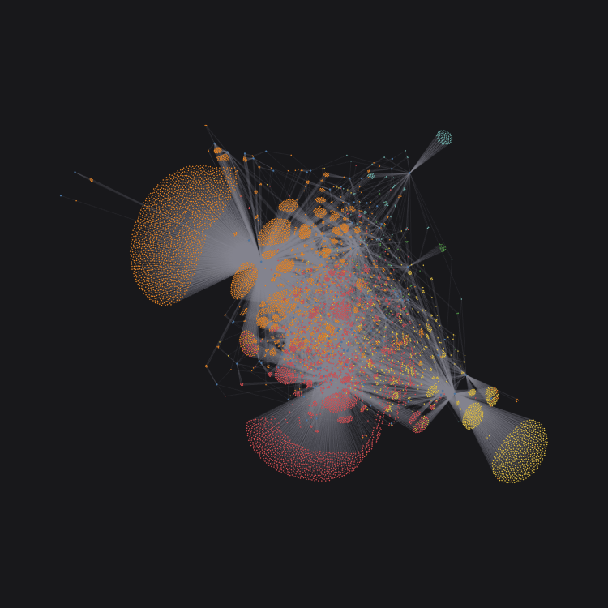
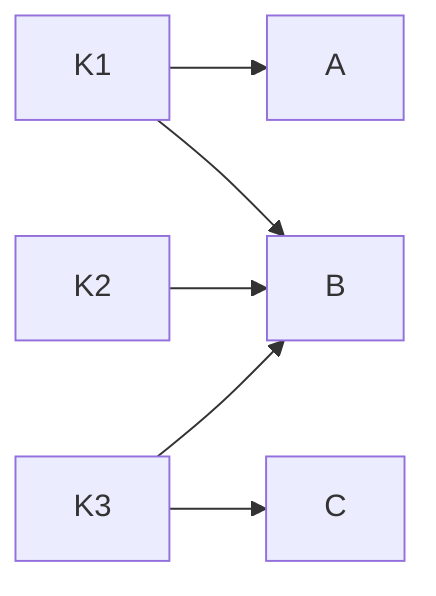

# Kata Clusters

Visualization of the Codewars kata library with [D3][d3].

  

## Background

The Codewars kata library is huge and diverse, but lacks structure. The tags are not defined well and the kata names are not always descriptive. It's challenging to find kata based on a topic, or continue to practice within a domain.

We'd like to start fixing this with the help from the community.

The main goal of this project is visualizing the current state of the library to understand the problems. However, it can be useful to explore the library and I'm open to expanding in that direction as well. It should be also motivating to see the progress as we make changes.

## Usage

Open <https://codewars.github.io/kata-clusters/> and play with it.

The blue circles are tags. The orange and the red are approved and beta kata respectively. Hover over a node to see the name.

Click and drag to pan, use the mouse wheel to zoom, or use touch.

Click a tag node to filter the view to only show kata with the tag. Click again, or press Escape, to view all kata again.

Click a kata node to filter the view to only show the kata and its tags. `Ctrl/Cmd + click` to open the kata on Codewars.

## Graph

The visualization represents the library as a [DAG][dag] with kata and tags as nodes.

The layout is a result of a simulation with [d3-force] using the following forces:

- `link`: The strength of a link to a tag is set to a value inversely proportional to the number of kata connecting to it. Links to uninteresting tags like `Fundamentals` and `Algorithm` are weak because thousans are linked to it.
- `charge`: Repel each other with strength `10`.
- `collide`: Avoid collision.

Kata with only weak links are pushed out, and kata with similar tags end up close to each other.

The visualization uses precomputed layout because it's impractical to simulate at runtime for this size. You can experiment with the configuration and regenerate with `npm run precompute`. Note that this can take minutes to finish.

[d3]: https://d3js.org/
[d3-force]: https://github.com/d3/d3-force
[dag]: https://en.wikipedia.org/wiki/Directed_acyclic_graph
